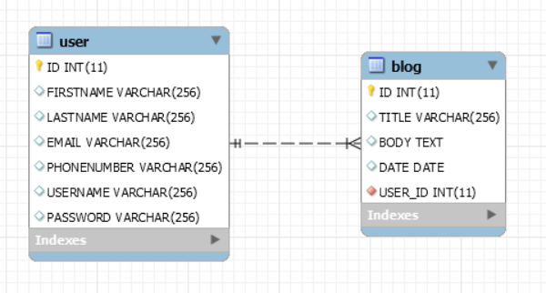
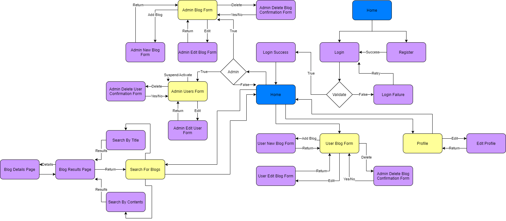
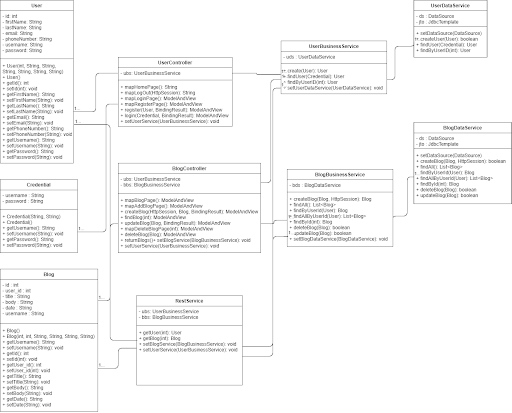
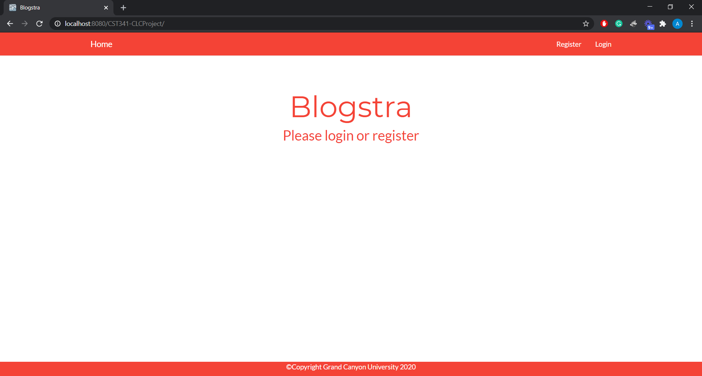
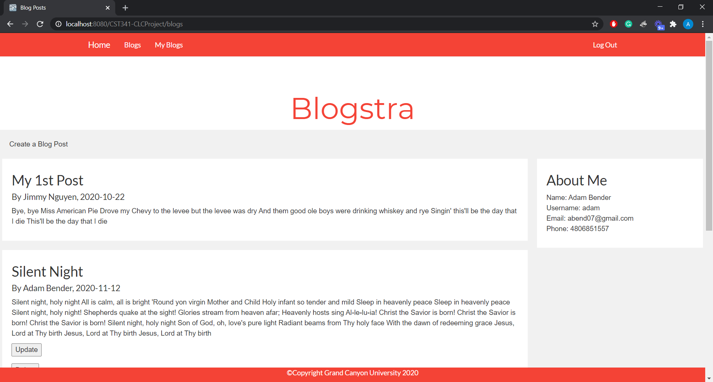
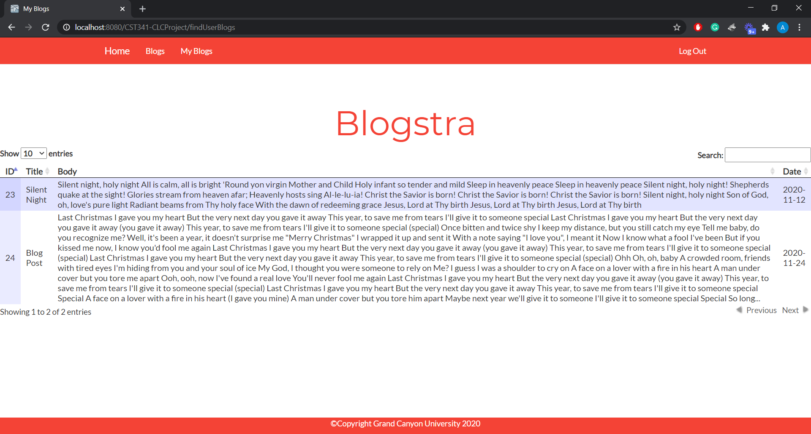
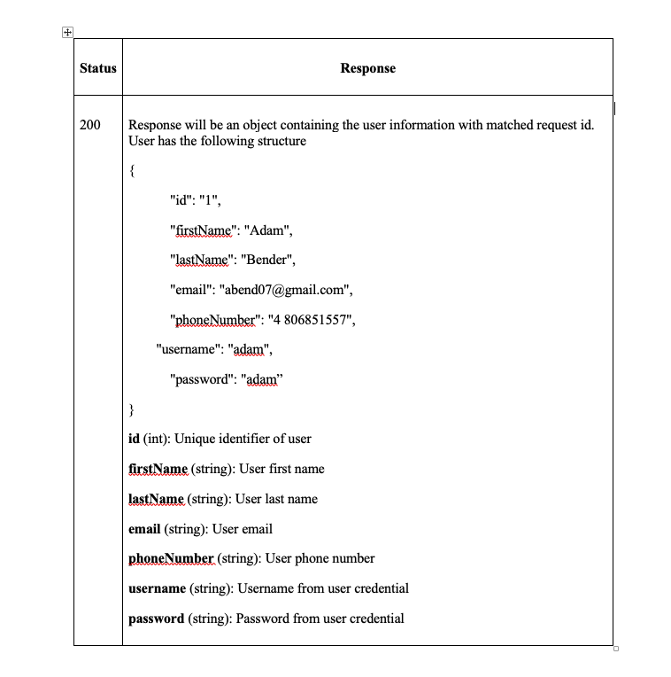
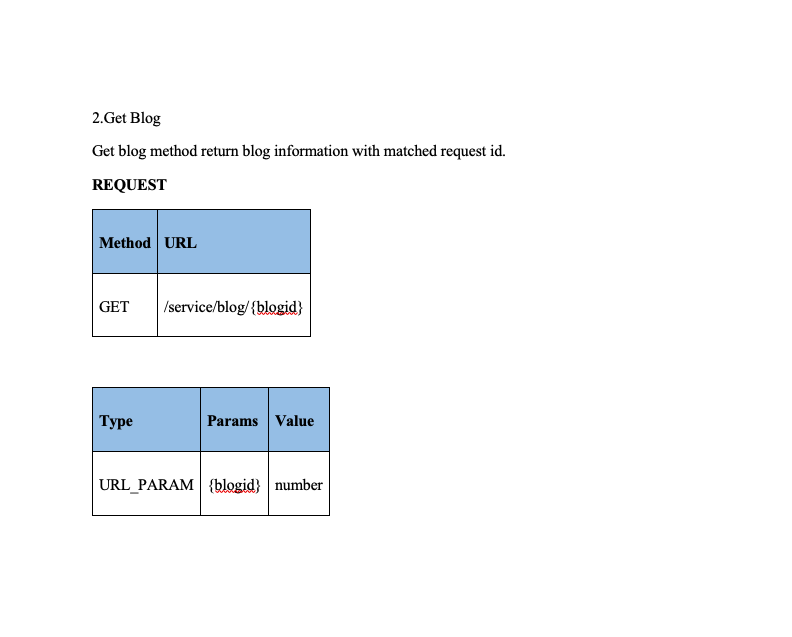
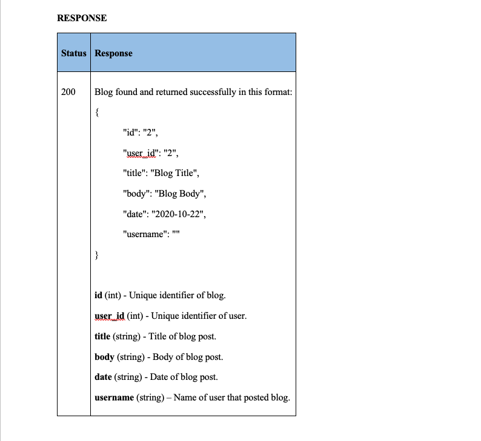

# Blogstra

 Blogstra is a blog web application using Java Spring MVC framework with implementation of  MySQL database, jQuery and RESTful service 

# ER diagram:

# Sitemap:

# UML Class Diagram

# Home Page

# Blog Page

# My Blogs Page

# Get User API

 Get User API Design 

 Get User API Response 

# Get Blog API

 Get Blog API Design 

 Get Blog API Response 

