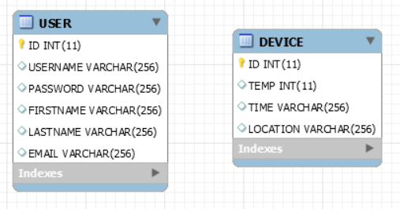
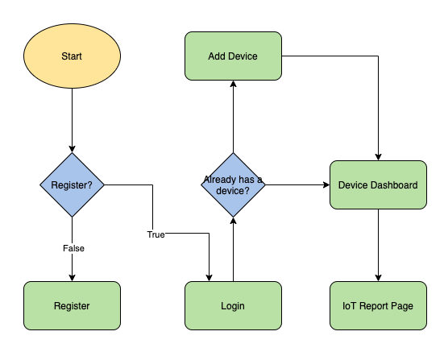
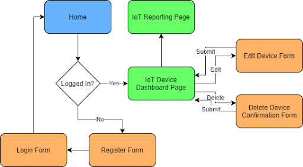
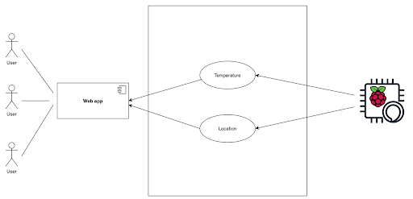
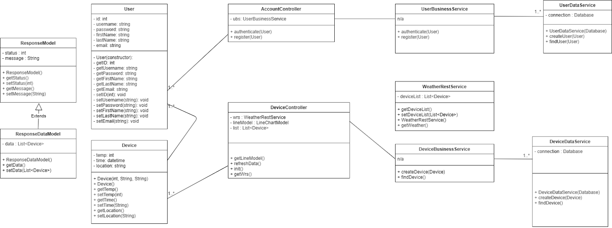

# Blogstra

 Blogstra is a blog web application using JAva Spring MVC framework with implementation of  MySQL database, jQuery and RESTful service 

# ER diagram:

# Flow Chart:

# Sitemap:

# UML Usecase Diagram:

# UML Component Diagram

# UML Class Diagram

